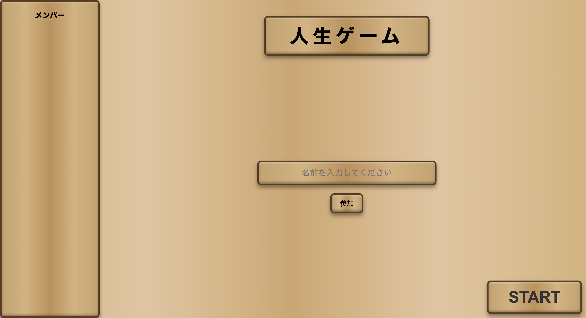
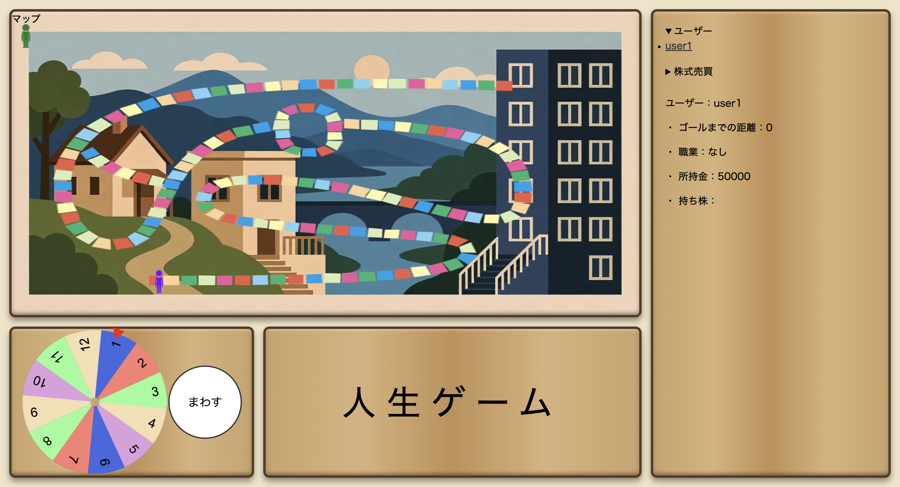

# Life and Investment

Life and Investment は、Flask を用いて構築された  
**複数人同時参加型の人生ゲーム（すごろく）Webアプリケーション**です。

ngrok を使用することで、  
**同一ネットワーク外のユーザーともリアルタイムでプレイ可能**です。

ルーレットを回してマスを進み、  
イベントによる所持金の増減や、株式売買を行いながら  
他のプレイヤーと競ってゴールを目指します。

---

##  コンセプト

**「株式売買によって、変動する人生を体験する」**

単純な双六ではなく、

- 安定かギャンブルかの選択  

を **ターン制ゲームとして体験できること** を目標に設計しました。

---

##  アピールポイント

- **複数人が同時に参加できるターン制ゲーム**
- サーバ側でターン管理・ルーレット結果を制御
- **株価が人生とともに変動する株式売買システム**
- Chart.js による **リアルタイム株価グラフ表示**
- 豊富なイベント
- 常時同期型のゲーム画面

---

##  主な機能

- ユーザーの参加・待機・ゲーム開始管理
- ルーレットによるマス移動
- マスイベント処理（就職・給料・事故・ボーナスなど）
- 所持金管理
- 株の購入・売却システム
- 株価のランダム生成と推移表示
- ゴール順位判定

---

##  使用技術

### バックエンド
- Python
- Flask

### フロントエンド
- HTML / CSS / JavaScript
- Chart.js（株価グラフ描画）

### 数値・データ処理
- numpy
- pandas

### 通信・公開
- ngrok

---

##  セットアップ

### 1. 前提条件

- **Python 3.8 以上**
- **pip**
- **ngrok**

### 2. 必要ライブラリのインストール

```bash
pip install flask numpy pandas matplotlib noise
```

## 使い方

### 1. アプリケーションの起動
```bash
python app.py
```

起動後、ローカルでは以下のURLでアクセス可能
```bash
http://localhost:8080
```

### 2. ngrokによって外部公開
別ターミナルで以下を実行
```bash
ngrok http 8080
```
表示されたURLのうち、次の形式のものを参加者に伝える。
```bash
https://xxxx-xx-xx-xx.ngrok-free.xxx
```

### 3.ゲーム参加
共有された上のURLにアクセスすると、トップ画面に遷移します。名前を入力し、全員の準備が完了するのを待ってください。


ゲームが開始した後は、自分のターンにルーレットを回し、ゴールを目指しましょう。


## 開発者の担当

- K24118 西田　拓矢 
    担当業務　プルリクエスト処理、進捗監査
- K24005 天野　椋祐
    担当業務　フロントエンド担当
- K24045 加藤　璃空
    担当業務　バックエンド担当・イベント実装
- K24047 鎌田　隼澄
    担当業務　画像作成
- K24145 横井　優宇
    担当業務　バックエンド担当・株売買処理実装
